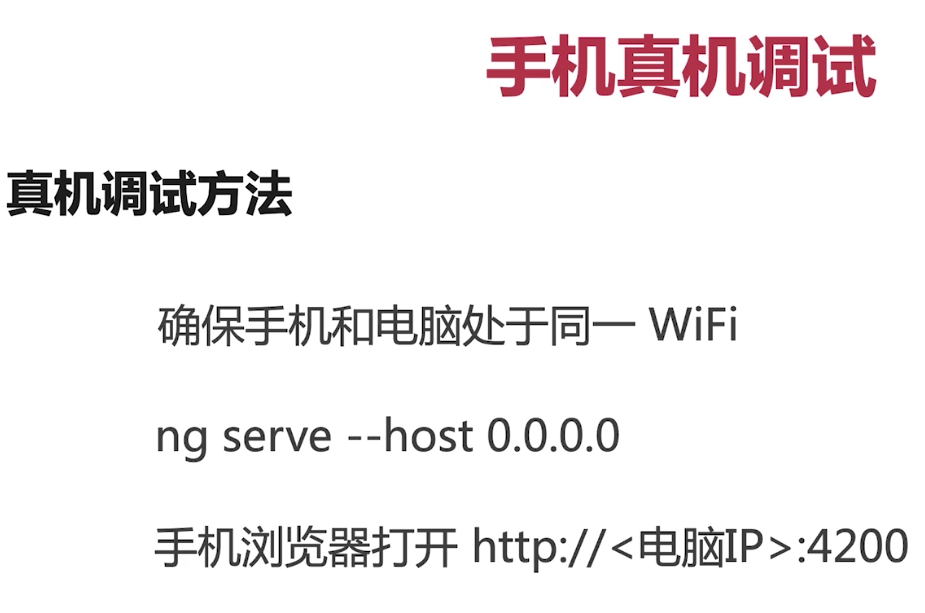

### 1-观察者模式

> 是一种软件设计模式，他有一个对象【主体subject】，用途：负责维护依赖项【观察者】的列表，在状态发生改变的时候自动通知列表中的观察者

#### 1.1编写思路

```ts
// Create an Observable that will start listening to geolocation updates
// when a consumer subscribes.
// 开发者为发布者 创建一个【可观察对象】
const locations = new Observable((observer) => {
  // 定义一个订阅者函数，功能：定义如何获取或生成那些需要发布的值或消息
  let watchId: number;

  // Simple geolocation API check provides values to publish
  if ('geolocation' in navigator) {
    watchId = navigator.geolocation.watchPosition((position: Position) => {
      observer.next(position);
    }, (error: PositionError) => {
      observer.error(error);
    });
  } else {
    observer.error('Geolocation not available');
  }

  // When the consumer unsubscribes, clean up data ready for next subscription.
  return {
    unsubscribe() {
      navigator.geolocation.clearWatch(watchId);
    }
  };
});

// Call subscribe() to start listening for updates.
// 从可观察对象中接收到消息，就需要订阅，即调用可观察对象上的订阅函数【subscribe】方法，并且传入一个观察者对象
// 这个观察者就像就是一个js对象，它定义了收到这些消息后，如何处理【handler】
// 返回值为一个unsuscription对象，这个对象上有个方法【unsubscribe】方法，功能：取消订阅消息
const locationsSubscription = locations.subscribe({
  next(position) {
    console.log('Current Position: ', position);
  },
  error(msg) {
    console.log('Error Getting Location: ', msg);
  }
});

// Stop listening for location after 10 seconds
setTimeout(() => {
  locationsSubscription.unsubscribe();
}, 10000);
```

#### 1.2观察者对象

> 观察者对象要实现Observer接口，这个对象定义了一些cb来处理可观察对象可能会发来的三种通知

+ next 			必要的 	用来处理每个送达的消息，在开始执行后可能执行0或者多次
+ error            可选的     用来处理错误通知
+ complete     可选的     用来执行完毕通知，当执行完毕通知，这些值就会传递给下一个处理器


#### 1.3订阅 如何订阅？

只能在订阅可观察对象【Observabel的实例】时，可观察对象才能发布值，订阅时需要调用该实例的subscribe()方法，并把一个观察者传递给它【这个订阅方法】

#### 1.4如何创建可观察对象

使用Observable构造函数可以创建任何类型的可观察对象【后面简称流】。**当执行可观察对象的subscribe()方法时，这个构造函数就会把它接收到的参数作为订阅函数来运行，订阅函数会接受一个Observer对象，并把值发布给观察者的next()方法。**

> 订阅的时候【调用订阅函数】就是执行实例化可观察对象是构造函数中的订阅函数

#### 1.5 多播

......待续

### 2-Rxjs库

> 响应式编程是一种面向数据流和变更传播的异步编程范式，RxJS是一个使用可观察对象进行响应式编程的库，它让组合异步代码和基于回调的代码变得更简单，

> RxJS提供了一种对Observable类型的实现，依赖Observabel，这个RxJS库提供了一些工具函数，用于创建和使用可观察对象

功能：

+ 把现有的异步代码转换为可观察对象
+ 迭代流中的各个值
+ 把这些值映射成其他类型
+ 对流进行过滤
+ 组合多个流

#### 2.1创建可观察对象的函数

+ from
+ interval
+ fromEvent
+ ajax

#### 2.2操作符

> 基于可观察对象构建的一些对集合进行复杂操作的函数

+ map    作用： 转换
+ filter    作用： 过滤
+ concat 作用： 连接
+ flatMap
+ .....等等

用法：以上操作符接受一些配置项，然后返回一个来源可观察对象为参数的函数，当执行这个返回的函数时，这个操作符会观察来源可观察对象中发出的值，转换他们，并返回由转换后的值组成的新的可观察对象

```ts
import { of } from 'rxjs';
import { map } from 'rxjs/operators';

const nums = of(1, 2, 3);
       //返回的是一个函数   // 接受的配置项
const squareValues = map((val: number) => val * val);
				// 可观察对象发出的值进行转换 	// 函数执行
const squaredNums = squareValues(nums);

squaredNums.subscribe(x => console.log(x));

// Logs
// 1
// 4
// 9
```

也可以通过**pipe**管道来使用多个操作符处理元数据

```ts
import { of, pipe } from 'rxjs';
import { filter, map } from 'rxjs/operators';

const nums = of(1, 2, 3, 4, 5);

// Create a function that accepts an Observable.
const squareOddVals = pipe(
  filter((n: number) => n % 2 !== 0),
  map(n => n * n)
);

// Create an Observable that will run the filter and map functions
const squareOdd = squareOddVals(nums);

// Subscribe to run the combined functions
squareOdd.subscribe(x => console.log(x));
```

### 3-Angular中的可观察对象

> angular使用可观察对象作为处理各种常用异步操作的接口，比如
>
> + EventEmitter类派生自Observable
> + HTTP模块使用可观察对象来处理Ajax请求和响应
> + 路由器和表单数据模块使用可观察对象来监听用户输入事件的响应


#### 1.1 组件之间传值

#### 1.2 http

#### 1.3 Async管道

#### 1.4 路由器

#### 1.3 响应式表单


### 装饰器：就是函数，在java中叫做注解

### ts中interface



### ngFor

```html
<ul>
  <li *ngFor="let menu of menus; let i = index"></li>
  <!-- 使用index索引值的情况 -->
</ul>
```

### 生成组件

```npm
ng g c 组件名称【驼峰】
```

生成四个文件，在module.ts文件中的声明的那个数组中加入生成的这个组件

> 技巧：在每级目录中写一个index.ts用来导出组件

### *ngIf


### 组件的输入输出


```ts
// 子组件
@input()
menus: TopMenu[] = []
@output()
tabSelected = new EventEmitter() // 

handle(i) {
  this.tabSelected.emit(this.menus[i])
}


// 父组件
<app-scrollable-tab [menus]="topMenus" (tabSelected)="handleSelected($event)"></app-scrollable-tab>

handleSelected(tabMenus){
  console.log(tabMenus)
}
```

### 样式的几种绑定方式


```css
.One {
  
}
.Two {
  
}
.....
```

### 组件声明周期

 

+ constructor 是组件实例化的时候调用的


```html
<ng-content></ng-content>
在子组件中使用


父组件中使用子组件的时候，可以在子组件的标签之间写写html片段，在子组件的ng-content中显示

```


### 操作原生dom节点


### 模块

> 提供独立功能的一组代码

+ 组成部分：组件、服务、管道、路由


+ import 我这模块需要依赖的模块「只能是模块」
+ export 给别人用，需要暴露的「可以模块 组件 服务 指令」
+ declaration 数组 我这个模块拥有的组件、指令、管道等，只限在本模块中使用的
+ bootstrap 应用启动时在那个组件开始启动  跟模块需要的
+ provider 「只是服务」本模块中需要使用到的服务

注意点:

+ httpClient/browsermodule/noopmodule，只需要在跟模块中导入一次就可以
+ commnonModule需要在每个模块中导入，提供双向绑定，指令等，formmodule、reactiveformmodule需要在各个模块中导入，提供组件、指令或管道的模块
+ 如果是服务，在根组件中导入一次就可以了，如果是组件，在每个需要的模块中都需要导入


### 什么是注解

>  就是一个函数，返回值也是一个函数，他是ts的一个特性

### 指令

+ 组件
+ 结构性指令 ngif ngfor nfswitch
+ 属性指令 ngclass ngstyle ngmodule
+ 