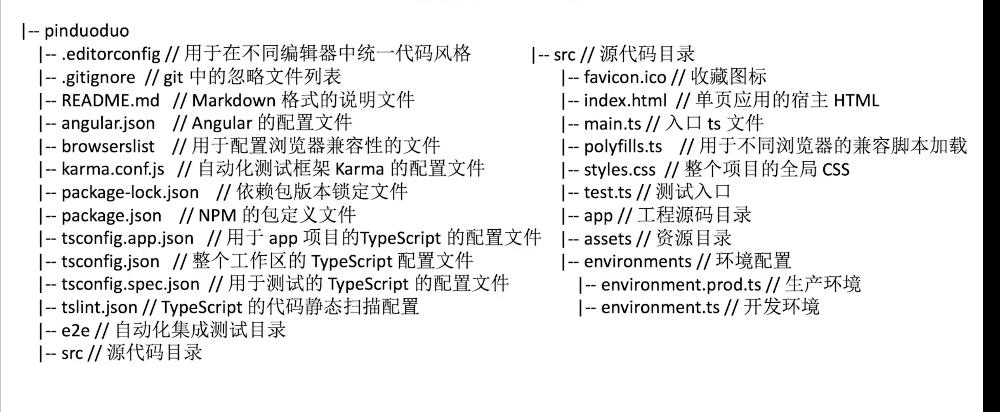

<!--
 * @Description: 
 * @Version: 2.0
 * @Autor: zhang-jinghui
 * @Date: 2021-04-23 20:58:24
 * @LastEditors: zhang-jinghui
 * @LastEditTime: 2021-04-23 21:00:32
-->
### package.json的版本控制
```json
{
  "vue": "2.0.2", // 严格控制这个版本
  "vue-cli": "~2.2.1", // 控制在2.2.0-2.2.9
  "vue-router": "^2.2.1" // 控制 2.0.0 - 2.9.9
}
```



