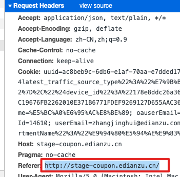

## general header

> 通用首部只能用于请求或者响应头中，根据上下文决定，不能用于消息实体首部

### 1-Date

> 报文创建的日期和时间

### 2-catche-control

> 通过对应的指令实现缓存

缓存请求指令

```http
Cache-Control: max-age=<seconds>
Cache-Control: max-stale[=<seconds>]
Cache-Control: min-fresh=<seconds>
Cache-control: no-cache
Cache-control: no-store
Cache-control: no-transform
Cache-control: only-if-cached
```

缓存响应指令

```http
Cache-control: must-revalidate
Cache-control: no-cache
Cache-control: no-store
Cache-control: no-transform
Cache-control: public
Cache-control: private
Cache-control: proxy-revalidate
Cache-Control: max-age=<seconds>
Cache-control: s-maxage=<seconds>
```

##### 指令分类

可缓存性

+ public   响应的结果可以任意的对象【浏览器，代理服务器】缓存，通常不可以缓存的内容也可以缓存【没有max-age,expiress】的消息，还有请求方法为post的请求
+ private 只能是用户的本地浏览器缓存响应结果
+ no-cache  每次发送请求，缓存【这里的缓存表示的事缓存机制，不是缓存的实体】会将该请求发送到服务器端，服务端会验证缓存是否过期，没有过期返回304，本次请求使用本地缓存副本
+ No-store  不使用缓存

缓存到期时间

+ max-age 缓存存储的最长周期  单位s 
+ S-maxage 覆盖了max-age和expiress ，但是仅用于共享的缓存，私有缓存会忽略这个到期时间
+ Max-stale 客户端可以接受一个已经过期的资源，这个字段可以设置一个可选的时间，表示
+ Min-fresh 表示客户端希望获取一个能在指定的秒数内保持其最新状态的响应。

重新验证或重新加载

+ must-revalidate


### 3-connection




### referer

> 请求头包含了当前请求页面或者【资源】的来源页面的地址，即表示当前页面是通过此来源页面里的链接进入的。服务端一般使用 `Referer` 请求头识别访问来源，可能会以此进行统计分析、日志记录以及缓存优化等。

请求头中不携带referer的情况

+ 本地文件 file协议的或者dataurl的
+ 当前请求页面为http，而来源页面采用https协议

### referer-policy

> **`Referrer-Policy`** 首部用来监管哪些访问来源信息——会在 [`Referer`](https://developer.mozilla.org/zh-CN/docs/Web/HTTP/Headers/Referer) 中发送——应该被包含在生成的请求当中。

指令

+ No-referer 访问来源信息被移除
+ No-referrer-when-downgrade(默认值) 安全级别 （https-https或者http-http）发送， （https-http）不发送
+ origin 只发送域名  http://example.com/page.html 只发送 http://example.com
+ Origin-when-cross-origin 同源发送完整的url地址，非同源仅发送文件的源
+ Same-origin 对于同源的发送请求引用地址，非同源的不发送
+ strict-origin同安全级别的情况下发送(https->https) 在降级的情况下不发送（https-> http）
+ Strict-origin-when-cross-origin 同源的发送完整的url 同等安全级别的情况下，发送文件的源，降级的情况下不发送

