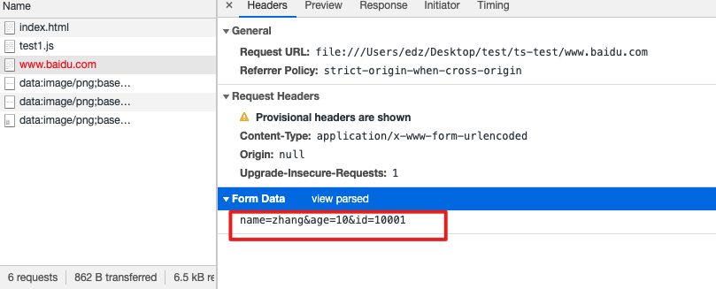
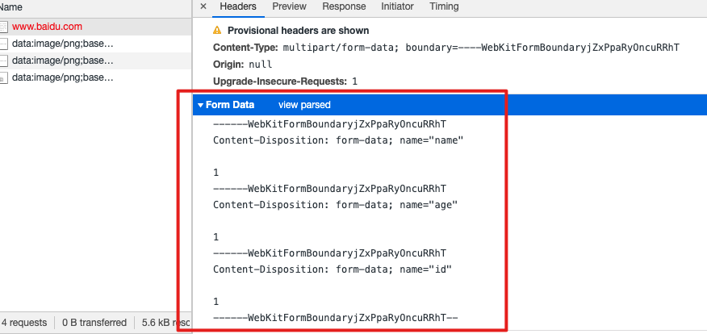
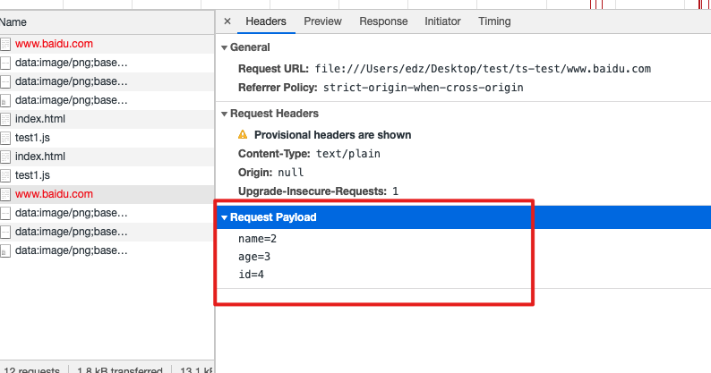
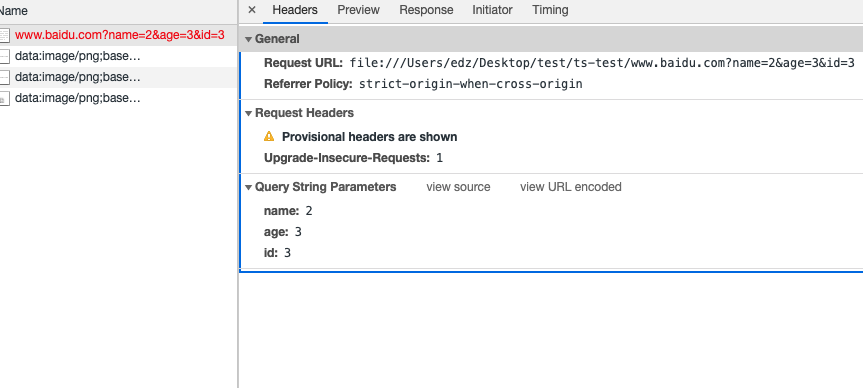
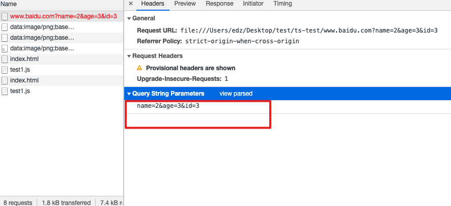

```html
<!DOCTYPE html>
<html lang="en">
<head>
    <meta charset="UTF-8">
    <meta http-equiv="X-UA-Compatible" content="IE=edge">
    <meta name="viewport" content="width=device-width, initial-scale=1.0">
    <title>Document</title>
</head>
<body>
		
    <form action="www.baidu.com" method="post">
        <label for="name">
            name
            <input type="text" id="name" name="name">
        </label>
        <label for="age">
            age
            <input type="text" id="name" name="age">
        </label>
        <label for="id">
            id
            <input type="text" id="name" name="id">
        </label>
        <button type="submit">提交</button>
    </form>
    
</body>
<script src="./test1.js"></script>
</html>
```

#### form为post请求时

点击提交按钮--参数为请求体中的

将form的编码格式属性设置为`<form action="www.baidu.com" method="post" enctype="application/x-www-form-urlencoded">`

参数的格式为



将form的编码格式属性设置为`<form action="www.baidu.com" method="post" enctype="multipart/form-data">`

参数的格式为



将form的编码格式设置为`<form action="www.baidu.com" method="post" enctype="text/plain">`

参数的格式为



#### get请求时


form的编码格式设置为`<form action="www.baidu.com" method="get" enctype="application/x-www-form-urlencoded">`

form的编码格式设置为`<form action="www.baidu.com" method="get" enctype="multipart/form-data">`

form的编码格式设置为`<form action="www.baidu.com" method="get" enctype="text/plain">`





#### http请求为什么进行序列化

+ java在后台处理参数的时候都是接受的序列化的参数
+ 

