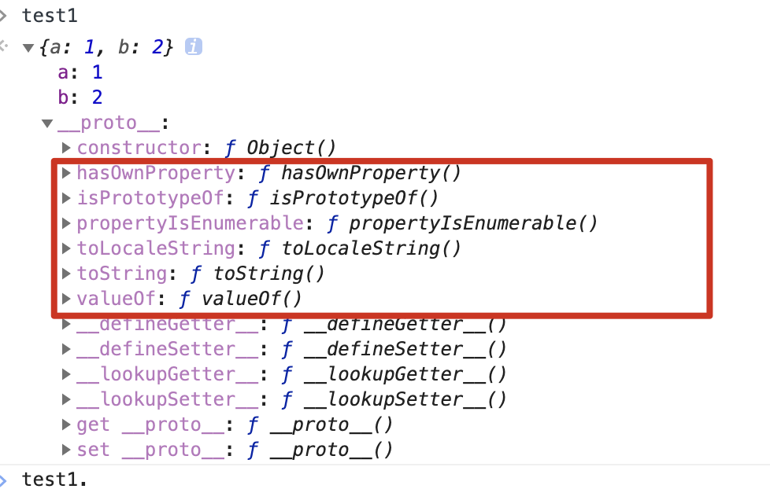
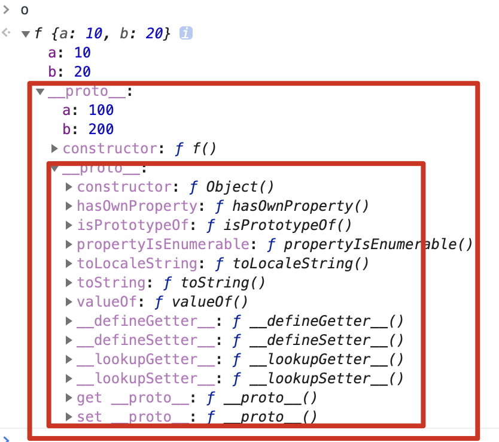

## 继承与原型链

当谈到继承的时候，js只有一种数据结构，对象，每个对象都有一个私有属性(`__proto__`)指向它的构造函数的原型对象（`prototype`）

```js
const test1 = { a: 10, b: 20 }
```



该原型对象也有自己的原型对象（`__proto__`）,层层向上直到一个对象的原型对象为`null`,根据定义，`null`没有原型，并作为这个原型链的最后一个环节

```js
// 上面的例子
test.__proto__.proto__   // ===>null
```


### 基于原型链的继承

#### 1、继承属性

js对象有一个指向一个原型对象的链，当试图访问一个对象的属性的时候，它不仅仅在该对象上搜索，还会搜索对象的原型上，以及对象的原型的原型，一次层层向上搜索，知道找到一个匹配或者到达原型链的末尾为止。

```js
function f() {
  this.a = 10
  this.b = 20
}

f.prototype.a = 100
f.prototype.b = 200

const o = new f()
o.a
o.b
// {a:1, b:2} ---> {b:3, c:4} ---> Object.prototype---> null  原型链
```



#### 2、继承方法

与继承属性没有区别，需要注意this的指向问题


