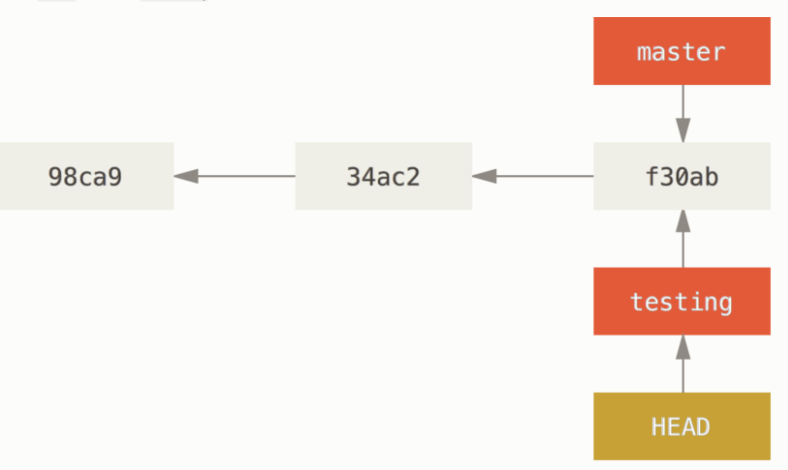

### 初始化git仓库的两种方式

1. 本地文件夹执行git init 得到.git目录，这里包含一些git的配置
2. git clone 将远程的代码仓库克隆下来，也包含了这个.git目录


### 关于.git目录

```bash
➜  .git git:(master) ls -F1 
HEAD
config
description
hooks/
info/
objects/
refs/
```

vi .git/info/exclude 可以加本地想忽略的文件，与.gitignore相比，这个是每个协同开发都需要遵守的，前者属于个性化

`config`

```bash
[core]
        repositoryformatversion = 0
        filemode = true
        bare = false
        logallrefupdates = true
        ignorecase = true
        precomposeunicode = true
[remote "origin"]
        url = git@git.edianzuno.cn:front-group/fed-coupon.git
        fetch = +refs/heads/*:refs/remotes/origin/*
[branch "develop"]
        remote = origin
        merge = refs/heads/develop
[branch "stage"]
        remote = origin
        merge = refs/heads/stage
[branch "dev/zhouhuiquan/fun-go/0112"]
        remote = origin
        merge = refs/heads/dev/zhouhuiquan/fun-go/0112
```

`description`

 项目的描述

`objects`

 目录存储所有数据内容

`HEAD`

当前指向的分支


#### 查看已暂存和未暂存的修改

`git status`


`git diff`

此命令比较的是工作目录中当前文件和暂存区域快照之间的差异。 也就是修改之后还没有暂存起来的变化内容。

`git diff --staged`

这条命令将比对已暂存文件与最后一次提交的文件差异


#### 提交更新

`git commit ` 

提交的时候不会记录这些**尚未暂存**的变化 

#### 跳过使用暂存区域

`git commit -a -m 'fix: 提交信息'` 跳过`git add .` 

#### 移除文件

正常已提交的文件，删除会产生版本，`git rm 文件`，删除文件，版本控制中的文件和本地文件都删除了

`git rm --cached 文件名`只是版本控制中的文件删除了，本地的还在【此时，该文件不被跟踪，需要后续的add commit 】、

#### 移动文件

`git mv file_form file_to` 重命名

## 撤销操作

#### 漏掉的文件需要重新提交

`git commit --amend` 替换上次的提交，不会再log中出现第二次提交

#### 取消暂存的文件

`git restore --staged 文件名`

`git reset 文件名`

#### 撤销对文件的修改

`git checkout -- index.html`

> 被删除的分支或者使用git commit --amend覆盖的数据都可以找到，没有提交过的事没有办法找到

## 远程仓库的使用

#### 查看远程仓库

`git remote -v`

#### 添加远程仓库

`git remote add pb https://github.com/paulboone/ticgit`

#### 删除关联的远程仓库

`git remote remote 别名`

#### 重命名关联远程仓库的别名

`git remote ranme name_from name_to`

## 分支

> 分支就是指向提交对象的可变指针

#### 创建分支

`git branch testing`

#### git 如何知道自己所在的分支？

> 在git中有个head的特殊指针，它是指向当前的本地分支


通过上图可以看到，使用命令`git branch testing`,只是创建了一个新的testing分支，并没有切换分支，head此时还是指向master，通过命令也可以看到

```bash
git log --oneline --decorate
24c20b1 (HEAD -> testing, git_test/main, main) fix: qqq // 在不同分支上切换版本会是什么样？
44eef27 fix: fefew
```

#### 分支切换

`git checkout testing`



此时本地分支就指向了testing

```bash
git log --oneline --decorate
2f110f4 (HEAD -> testing) made a change on testing-branch
24c20b1 (git_test/main, main) fix: qqq
44eef27 fix: fefew
262181d fix:add
a380380 fix: 删除
e410d0c hehehe
775ec8e ddd
```

可以看到testing分支向前移动一个一个提交对象

`git checkout main`


切换回main分支，git做了两件事，将分支head指向main分支，并将工作目录恢复为main指向的快照内容

> **分支切换会改变你工作目录中的文件**
>
> 在切换分支时，一定要注意你工作目录里的文件会被改变。 如果是切换到一个较旧的分支，你的工作目录会恢复到该分支最后一次提交时的样子。 如果 Git 不能干净利落地完成这个任务，它将禁止切换分支。

```bash
➜  test git:(main) ✗ git add .
➜  test git:(main) ✗ git commit -m 'made a change on main branch'
```

此时的本地工作目录的git分支如下: 


分支合并之后，需要执行add 然后提交merge信息

#### 分支管理

查看所有分支的最后一次提交

`git branch -v`

删除分支

`git branch -d 分支名称`

查看是否合并到当前分支的其他分支

`git branch --no-merged` 或者 `git branch --merged`

#### 分支工作流


#### 远程分支

推送

`git push origin serverfix`

抓取


```bash
$ git fetch origin
remote: Counting objects: 7, done.
remote: Compressing objects: 100% (2/2), done.
remote: Total 3 (delta 0), reused 3 (delta 0)
Unpacking objects: 100% (3/3), done.
From https://github.com/schacon/simplegit
 * [new branch]      serverfix    -> origin/serverfix
```

> 这种情况下，不会有一个新的 `serverfix` 分支——只有一个不可以修改的 `origin/serverfix` 指针。

如果要使用新拉去下来的分支

+ 可以运行 `git merge origin/serverfix` 将这些工作合并到当前所在的分支
+ `git checkout -b serverfix origin/serverfix`这会给你一个用于工作的本地分支，并且起点位于 `origin/serverfix`。

#### 跟踪分支

未完......


#### git提交信息规范

[地址](https://blog.csdn.net/ligang2585116/article/details/80284819)

```js
 <option value="2">拜访</option>
<option value="3">微渠道</option>
<option value="4">会议活动</option>
<option value="5">孵化器</option>
<option value="6">其它</option>
<option value="7">中华英才网</option>
<option value="14">IT桔子</option>
<option value="20">天猫</option>
<option value="21">脉脉</option>
<option value="23">企业法人</option>
<option value="71">市场渠道</option>
```

