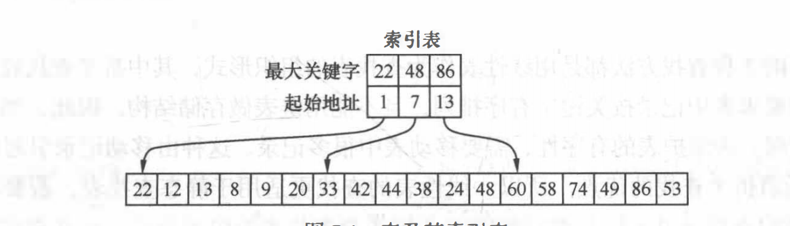

# 查找方法

## 顺序表查找

### 1-顺序查找

```js
const arr = [11,2,3,4,5,6,7,8,0]

for(let i = arr.length-1; arr[0] !== arr[i]; i--)
	return i
```

> 以上是改进的算法，减少了判断的时间，顺序查找的缺点是：平均查找的时间长，不适合基数大的集合

时间复杂度: O(n)

### 2-折半查找【二分查找】

> 适用范围: 
>
> 1、线性表必须是顺序存储结构
>
>  2、表中的元素必须是按关键字进行排序的

查找的过程:

从表的中间标记开始，如果给定的值与中间标记关键字的值相等，结束查找，如果给定的值大于或者小于中间标记关键字的值，则继续在大于或者小于那段标记中查找，这样重复操作

代码实现:

```js
function getTargetValue(arr, key = 12) {
  let start = 0
  let end = arr.length - 1
  // 获取中间标记即目标元素索引
  let midIndex = Math.floor(end - start)

  while(key !== arr[midIndex]) {
    // 如果key 大于中间标记
    if(key > arr[midIndex]) {
      start = midIndex + 1
    }
    // 如果key 小于中间标记
    if(key < arr[midIndex]) {
      end = midIndex - 1
    }
    midIndex = start + Math.floor(end - start)
  }
  return midIndex
}
// 数据满足是顺序存储，并且是有序的
let arr = [1,2,3,4,5,6,7,8,9,10,11,12,13,14,15]
getTargetValue(arr, 12) // 11
```

时间复杂度: O(log2n)

### 3-分块查找



指定key，现在索引表中找到所在的片段，然后再去对应的片段中找到key，第二步可以使用顺序查找，如果元素是有序的可以使用折半查找。

